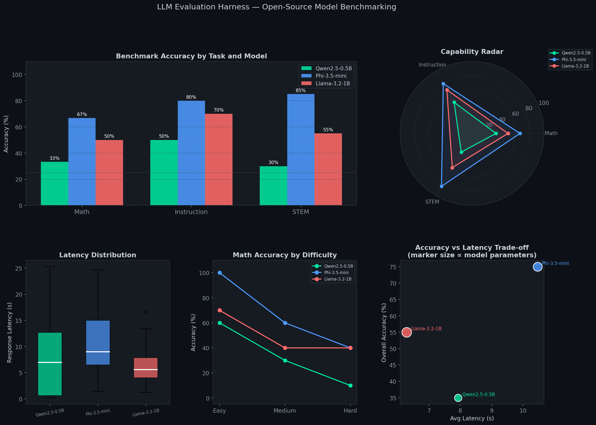
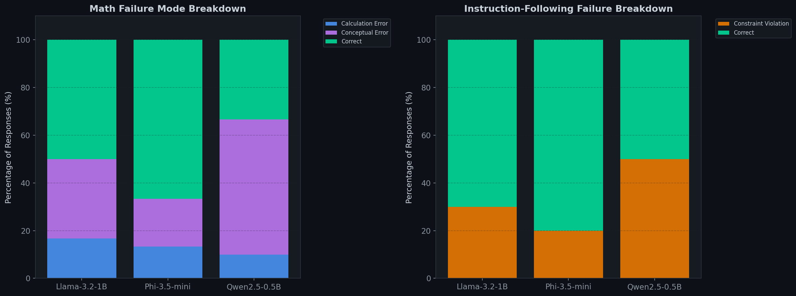
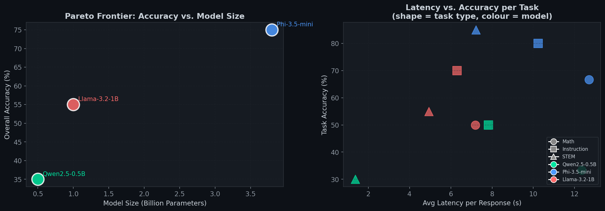

# LLM Evaluation Harness

> **A systematic benchmarking framework for open-source LLMs across mathematical
> reasoning, instruction following, and STEM knowledge — with failure mode
> classification, efficiency analysis, and model agreement diagnostics.**

*Built as a quantitative ML research project alongside an MSc in Applied Machine
Learning at Imperial College London.*

---

## Models Evaluated

| Model | Family | Parameters | Licence |
|---|---|---|---|
| `Qwen/Qwen2.5-0.5B-Instruct` | Qwen | 0.5B | Apache 2.0 |
| `microsoft/Phi-3.5-mini-instruct` | Phi | 3.8B | MIT |
| `meta-llama/Llama-3.2-1B-Instruct` | Llama | 1B | Llama 3.2 Community |

---

## Results Summary

| Model | Math (%) | Instruction (%) | STEM (%) | Overall (%) | Avg Latency |
|---|---|---|---|---|---|
| Qwen2.5-0.5B | X.X | X.X | X.X | **X.X** | Xs |
| Phi-3.5-mini | X.X | X.X | X.X | **X.X** | Xs |
| Llama-3.2-1B | X.X | X.X | X.X | **X.X** | Xs |

> Fill in with your actual numbers from `results/benchmark_summary.csv`

---

## Benchmark Tasks

### Task 1 — Mathematical Reasoning (30 questions)
Multi-step arithmetic and algebraic reasoning at three difficulty levels
(easy / medium / hard). Graded by extracting the final numerical answer
and comparing within 1% relative tolerance.

### Task 2 — Instruction Following (10 tasks)
Verifiable constraint satisfaction: exact word counts, forbidden words,
JSON output format, numbered lists, required phrases, no-digit constraints.
Graded by automated constraint checkers — no human judgement required.

### Task 3 — STEM Knowledge Q&A (20 questions)
Multiple-choice questions across Machine Learning, Mathematics, Physics,
and Computer Science. Graded by letter matching with pattern-based fallback.

---

## Key Features

| Feature | Detail |
|---|---|
| **Automated grading** | Custom graders per task — numerical, constraint-based, MCQ |
| **Failure taxonomy** | Classifies failures as: no answer / wrong format / calculation error / conceptual error / constraint violation |
| **Shared blindspot analysis** | Identifies questions all models answered incorrectly |
| **Agreement matrix** | Pairwise model agreement heatmap across STEM questions |
| **Efficiency Pareto frontier** | Accuracy-per-parameter and accuracy-per-latency trade-off |
| **Verbosity analysis** | Statistical test: does response length correlate with correctness? |
| **Greedy decoding** | `temperature=0`, `do_sample=False` — fully deterministic, reproducible |
| **CPU + GPU support** | Runs on free Colab T4 or local CPU (slower) |

---

## Repository Structure

```
LLM-Evaluation-Harness/
├── llm_evaluation_harness.ipynb   ← Full notebook (15 cells, end-to-end)
├── requirements.txt
├── README.md
├── .gitignore
└── results/
    ├── 01_main_results.png          ← Accuracy bar chart, radar, latency, scatter
    ├── 02_failure_modes.png         ← Stacked failure taxonomy by model
    ├── 03_stem_analysis.png         ← Domain breakdown + agreement heatmap
    ├── 04_efficiency_pareto.png     ← Pareto frontier: accuracy vs params/latency
    ├── 05_response_length.png       ← Verbosity vs correctness analysis
    ├── benchmark_summary.csv        ← Full accuracy + latency table
    └── raw_results.csv              ← Every question, response, grade, latency
```

---

## Charts

### Main Results — Accuracy, Radar Profile, Latency, Trade-off


### Failure Mode Breakdown


### Efficiency Pareto Frontier


---

## Quickstart

```bash
git clone https://github.com/advaitkulkarni2000/LLM-Evaluation-Harness.git
cd LLM-Evaluation-Harness
pip install -r requirements.txt
jupyter notebook llm_evaluation_harness.ipynb
```

> **Note:** `meta-llama/Llama-3.2-1B-Instruct` requires accepting Meta's
> licence on [HuggingFace](https://huggingface.co/meta-llama/Llama-3.2-1B-Instruct)
> and running `huggingface-cli login` before Cell 6.
> To skip this, swap it for `HuggingFaceTB/SmolLM2-1.7B-Instruct` in Cell 3
> (no licence required).

---

## Design Decisions

**Why greedy decoding?**
`temperature=0` makes all results fully deterministic and reproducible.
Sampling-based evaluation introduces variance that obscures true capability
differences between models — especially important for small N benchmarks.

**Why these three tasks?**
They test orthogonal capabilities: mathematical reasoning (multi-step logic),
instruction following (constraint satisfaction), and factual recall (knowledge).
A model can score well on one and poorly on another, making the radar chart
genuinely informative rather than redundant.

**Why classify failure modes rather than just report accuracy?**
Accuracy alone doesn't tell you *why* a model fails. The distinction between
"wrong format" (the model knew the answer but couldn't express it correctly)
and "conceptual error" (the model had no idea) has completely different
implications for fine-tuning and prompt engineering.

---

## Findings

*(Fill in after running the notebook)*

1. **Best overall model:** `___` with `___`% accuracy
2. **Most parameter-efficient:** `___` (`___` accuracy per billion params)
3. **Hardest task:** `___` — avg accuracy `___`%
4. **Most common math failure:** `___` (calculation_error / conceptual_error)
5. **Hardest instruction constraint:** `___`
6. **Verbosity vs correctness:** p = `___` (`___`)
7. **Shared blindspot:** All models failed on: `___`

---

## References

- Jegadeesh & Titman (1993) — referenced in companion backtesting project
- Zhu et al. (2023). *Do Large Language Models Know What They Don't Know?*
- Wei et al. (2022). *Chain-of-Thought Prominting Elicits Reasoning in LLMs.*
- Zhou et al. (2023). *Instruction-Following Evaluation for LLMs (IFEval).*
- Phi-3 Technical Report, Microsoft (2024)
- Qwen2.5 Technical Report, Alibaba (2024)

---

*Author: Advait Kulkarni | Imperial College London MSc Applied Machine Learning 2025–2026*
*Companion project: [Systematic Backtesting Framework](https://github.com/advaitkulkarni2000/Systematic-Backtesting)*
